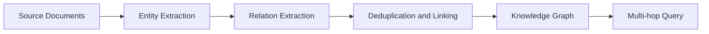

A knowledge graph represents information as entities (nodes) connected by relations (edges). This structure makes facts explicit and traversable, unlike free text.[^1] Paired with a language model, a knowledge graph can supply structured context for retrieval: instead of returning raw text chunks, the system can return the entities and relations relevant to a query.[^1]

## Multi-Hop Reasoning

Graphs enable multi-hop reasoning — following chains of relations from one entity to another — which flat embedding search over document chunks, as used in [Retrieval-Augmented Generation](retrieval-augmented-generation.md), cannot easily do.[^1]

## Building a Knowledge Graph

Building a knowledge graph from documents involves three steps:[^1]

1. Extracting entities from source text
2. Extracting the relationships between those entities
3. Deduplicating and linking mentions of the same real-world thing

Entity and relation extraction is typically performed by a [Transformer](../entities/transformer-architecture.md)-based language model reading the source documents.

## Related Pages

- [Retrieval-Augmented Generation](retrieval-augmented-generation.md) — the chunk-based retrieval approach knowledge graphs complement
- [Transformer Architecture](../entities/transformer-architecture.md) — typically used to extract entities and relations
- [RAG vs Knowledge Graphs](../comparisons/rag-vs-knowledge-graphs.md)

[^1]: knowledge-graphs.pdf, p.1
