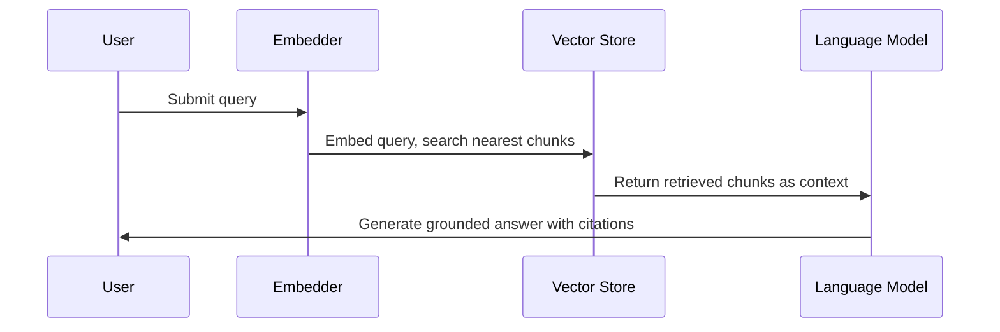

Retrieval-Augmented Generation (RAG) combines a large language model with an external knowledge store, so the model can ground its answers in retrieved documents rather than relying solely on its parameters.[^1] RAG reduces hallucination and lets a model use knowledge it was never trained on, which is why it underpins most document-question-answering systems.[^1]

## How It Works

Source documents are split into chunks and converted into embeddings — dense vectors that place semantically similar text near each other in vector space.[^1] At query time the user's question is embedded and a vector search returns the nearest chunks. These are passed to the [Transformer](../entities/transformer-architecture.md)-based language model as context, which then generates a grounded answer with citations.[^1]

## Limitations

Vector search over flat chunks retrieves by semantic similarity alone — it does not explicitly follow chains of relations between entities the way a [Knowledge Graph](knowledge-graphs.md) can, which limits RAG on multi-hop questions.[^2]

## Related Pages

- [Knowledge Graphs](knowledge-graphs.md) — a structured alternative/complement to chunk-based retrieval
- [Transformer Architecture](../entities/transformer-architecture.md) — the generation model in a RAG pipeline
- [RAG vs Knowledge Graphs](../comparisons/rag-vs-knowledge-graphs.md)

[^1]: rag.pdf, p.1
[^2]: knowledge-graphs.pdf, p.1
