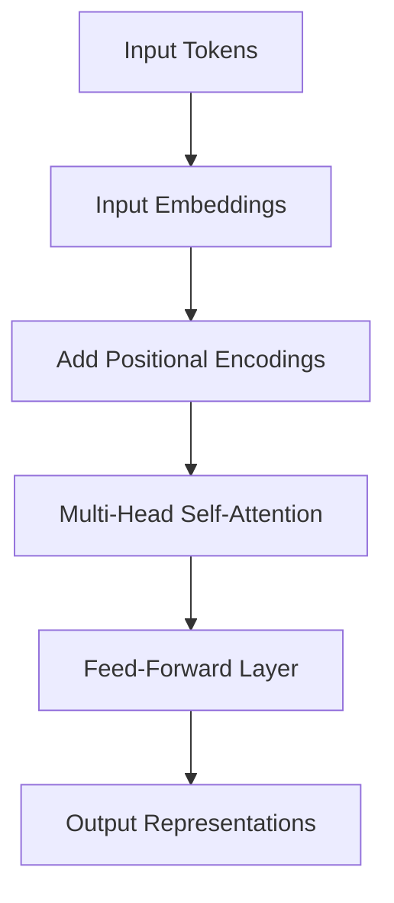

The Transformer is a neural network architecture introduced in 2017 that relies entirely on attention mechanisms, dispensing with recurrence and convolutions.[^1] It has become the foundation of modern large language models, including the models that power [Retrieval-Augmented Generation](../concepts/retrieval-augmented-generation.md) pipelines and the entity extraction step behind [Knowledge Graphs](../concepts/knowledge-graphs.md).

## Self-Attention

Self-attention lets each token in a sequence attend to every other token, computing a weighted sum of their representations.[^1] This captures long-range dependencies that recurrent networks struggle with, since every position has a direct path to every other position rather than a chain of sequential steps.

## Positional Encodings

Because the architecture has no inherent notion of order — attention treats the input as a set, not a sequence — positional encodings are added to the input embeddings so the model can reason about the position of each token in the sequence.[^1]

## Multi-Head Attention

Multi-head attention runs several attention operations in parallel, letting the model jointly attend to information from different representation subspaces. The outputs are concatenated and projected.[^1]

## Related Pages

- [Retrieval-Augmented Generation](../concepts/retrieval-augmented-generation.md) — the LLM half of a RAG pipeline is typically a Transformer
- [Knowledge Graphs](../concepts/knowledge-graphs.md) — entity/relation extraction from text is usually done with a Transformer-based model
- [RAG vs Knowledge Graphs](../comparisons/rag-vs-knowledge-graphs.md)

[^1]: transformers.pdf, p.1
