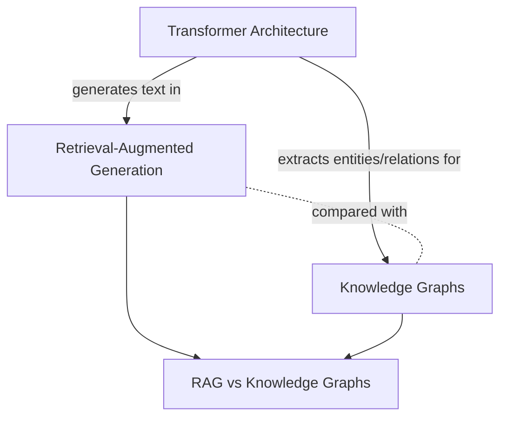

This wiki covers the core architecture behind modern language models and two complementary strategies for grounding their outputs in external data. It currently draws on 3 sources and spans 5 wiki pages.

- **Sources:** 3 (knowledge-graphs.pdf, rag.pdf, transformers.pdf)
- **Wiki pages:** 5 (1 entity, 2 concepts, 1 comparison, this overview)

## Map

## Key Findings

- The [Transformer](entities/transformer-architecture.md) architecture (2017) replaced recurrence and convolution with self-attention plus positional encodings, and is the backbone model underneath both retrieval strategies below.
- [Retrieval-Augmented Generation](concepts/retrieval-augmented-generation.md) grounds a language model by embedding document chunks into vectors and retrieving the nearest ones at query time — cheap to build, but limited to single-hop semantic matches.
- [Knowledge Graphs](concepts/knowledge-graphs.md) instead store explicit entities and relations, enabling multi-hop reasoning that flat vector search cannot do, at the cost of an entity/relation extraction pipeline.
- See [RAG vs Knowledge Graphs](comparisons/rag-vs-knowledge-graphs.md) for a direct comparison — the two approaches are complementary, not mutually exclusive.

## Pages

- [Transformer Architecture](entities/transformer-architecture.md)
- [Retrieval-Augmented Generation](concepts/retrieval-augmented-generation.md)
- [Knowledge Graphs](concepts/knowledge-graphs.md)
- [RAG vs Knowledge Graphs](comparisons/rag-vs-knowledge-graphs.md)

## Recent Updates

- 2026-07-12: Initial ingest of all 3 sources (transformers.pdf, rag.pdf, knowledge-graphs.pdf); created entity page for Transformer Architecture, concept pages for RAG and Knowledge Graphs, and a synthesis comparison page.
